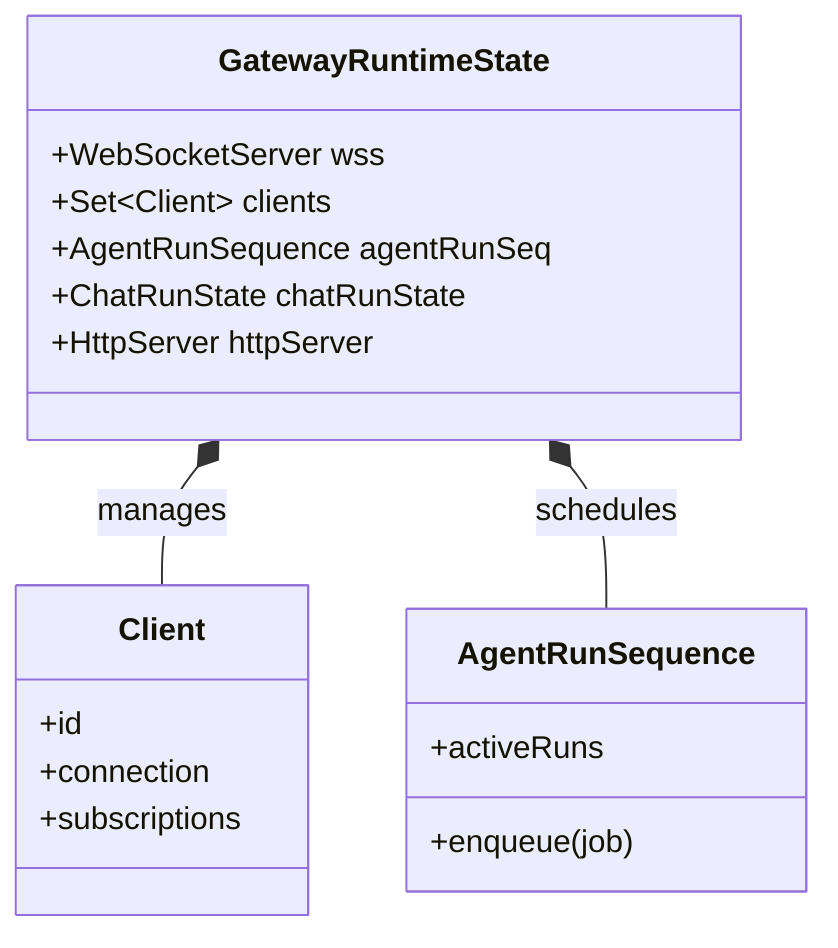
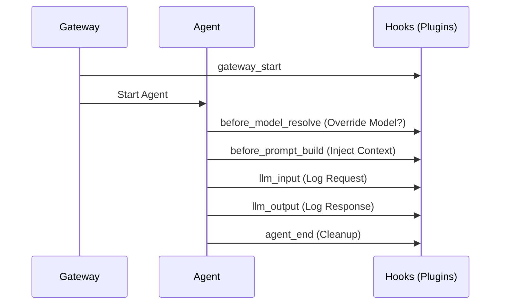
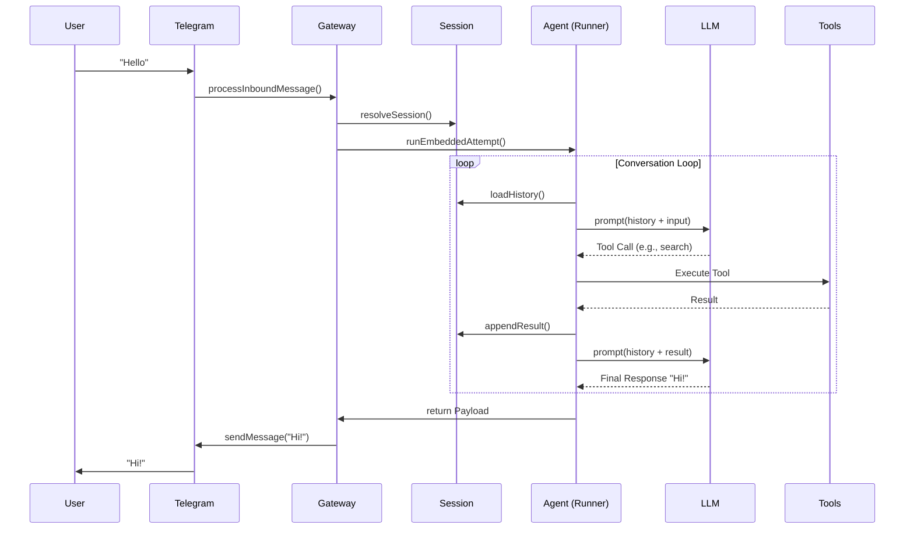
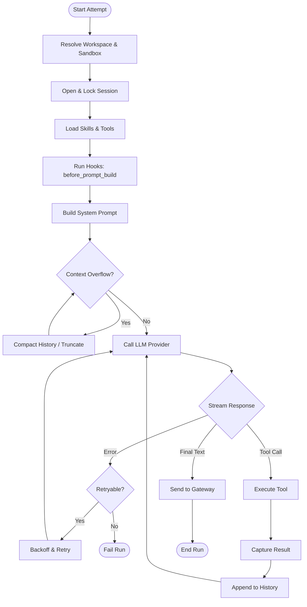

# OpenClaw Architecture Guide

This document provides a comprehensive technical overview of OpenClaw, a personal AI assistant designed to run locally on your own devices. It is intended for developers who want to understand the system's architecture, lifecycle, and core components.

## 1. Big Picture Overview (Macro Level)

### Problem Statement
OpenClaw solves the problem of having a truly personal, privacy-focused AI assistant that can interact with the real world through messaging channels (Telegram, WhatsApp, Slack, etc.) and perform actions on your local machine, without relying on a centralized SaaS provider for orchestration.

### Core Design Goals
*   **Local-First**: The "brain" and execution environment run on your hardware.
*   **Privacy & Security**: Data stays with you. You control the keys and the runtime.
*   **Extensibility**: A plugin system allows adding new capabilities (skills, channels) without modifying the core.
*   **Multi-Channel**: Interact with your assistant from anywhere via standard messaging apps.

### System Type
OpenClaw is a **distributed system** (Gateway + Agents) that acts as a **personal platform**. It combines:
*   A **Gateway** (Control Plane): Manages connections, routing, and state.
*   **Agents** (Execution Plane): The AI logic (Pi Agent) that processes requests.
*   **Channels**: Adapters for external messaging services.

### Conceptual Architecture

```mermaid
graph TD
    User((User)) -->|Telegram/WhatsApp/etc.| Channel[Channel Adapter]
    Channel -->|Normalized Message| Gateway[Gateway (Control Plane)]

    subgraph "Local Device / Server"
        Gateway -->|Route| Session[Session Manager]
        Session -->|Context| Agent[Pi Agent (Execution)]

        Agent -->|Prompt| LLM[LLM Provider (OpenAI/Anthropic/Local)]
        LLM -->|Response/Tool Call| Agent

        Agent -->|Execute| Tool[Local Tools (Bash, Browser, etc.)]
        Tool -->|Result| Agent

        Agent -->|Reply| Gateway
    end

    Gateway -->|Outbound Message| Channel
    Channel -->|Reply| User
```

## 2. System Architecture Decomposition

The system is decomposed into four major subsystems:

### 2.1. Gateway (The Hub)
*   **Responsibility**: The central nervous system. It initializes the application, loads configuration, manages the plugin registry, and handles the WebSocket control plane.
*   **Key Components**:
    *   `GatewayServer`: The main entry point and lifecycle manager.
    *   `ChannelManager`: Manages the lifecycle of channel adapters.
    *   `PluginRegistry`: Loads and registers plugins (skills, hooks, channels).
*   **Data Flow**: Receives raw events from channels -> Normalizes them -> Routes to the appropriate Agent Session.

#### Gateway Internal State
The `GatewayRuntimeState` is the in-memory brain. It holds:



### 2.2. Agents (The Brain)
*   **Responsibility**: executing the AI logic. This includes constructing prompts, calling the LLM, executing tools, and managing the conversation loop.
*   **Key Components**:
    *   `PiEmbeddedRunner`: The core agent loop implementation.
    *   `SessionManager`: Manages conversation history, state, and persistence.
*   **Abstraction**: The "Agent" is an abstraction over a stateless LLM call + stateful session history + executable tools.

### 2.3. Channels (The Interface)
*   **Responsibility**: Adapting external messaging protocols to OpenClaw's internal message format.
*   **Examples**: Telegram, WhatsApp, Slack, Discord.
*   **Contract**:
    *   **Input**: Raw webhook/polling events.
    *   **Output**: Normalized `InboundMessage` objects sent to the Gateway.
    *   **Action**: Sending `OutboundMessage` objects back to the user.

### 2.4. Plugins & Skills (The Capabilities)
*   **Responsibility**: Extending the system with new functionality.
*   **Types**:
    *   **Skills**: Collections of tools (e.g., "search", "calendar").
    *   **Hooks**: Intercepting lifecycle events (e.g., `before_prompt_build`).
    *   **Channels**: Adding support for new messaging platforms.

#### Hook Lifecycle



## 3. Lifecycle-Driven Walkthrough (End-to-End Flow)

Let's follow a single message from a user on Telegram to the assistant and back.

### Step 1: Ingress (Telegram -> Gateway)
1.  **Event**: User sends "Hello" to the Telegram bot.
2.  **Reception**: The `TelegramChannel` (via `grammy` bot) receives the webhook/update.
3.  **Processing**: `processInboundMessage` is called. It performs authorization checks (allowlists).
4.  **Debounce**: Messages are debounced (grouped) to handle rapid-fire inputs.
5.  **Normalization**: The Telegram message is converted into an internal OpenClaw message format.
6.  **Routing**: The Gateway determines which Agent Session this message belongs to.
    *   **Logic**: `PeerID` (e.g., `telegram:12345`) -> `SessionKey` (e.g., `agent:default:telegram:12345`).
    *   **Threads**: If it's a topic/thread, the key includes the topic ID.

### Step 2: Agent Execution (Gateway -> Agent)
1.  **Session Loading**: The `Gateway` invokes the `PiEmbeddedRunner` for the target session.
2.  **Context Construction**: The `SessionManager` loads the conversation history.
3.  **Prompt Engineering**: The `SystemPrompt` is built, injecting:
    *   Core identity instructions.
    *   Available tools (Skills).
    *   Context (Time, OS, etc.).
    *   User's message.
4.  **LLM Call**: The constructed prompt is sent to the configured LLM (e.g., Anthropic Claude).

### Step 3: Tool Execution (The Loop)
1.  **Response Analysis**: The LLM responds. It might be a text reply or a **Tool Call** (e.g., "I need to search the web").
2.  **Execution**: If it's a Tool Call, the `PiEmbeddedRunner` executes the corresponding JavaScript/TypeScript function.
3.  **Result Injection**: The tool's output is added to the conversation history.
4.  **Recursion**: The loop repeats (Step 2.3 -> 2.4) until the LLM produces a final text response.

### Step 4: Egress (Agent -> Gateway -> Telegram)
1.  **Completion**: The agent produces a final text response: "Hi there! How can I help you?".
2.  **Handoff**: The response is passed back to the Gateway.
3.  **Delivery**: The Gateway routes the response to the `TelegramChannel`.
4.  **Transmission**: The `TelegramChannel` uses the Telegram API to send the message to the user.



## 4. Deep Dive into Core Components (Micro Level)

### 4.1. GatewayServer (`src/gateway/server.impl.ts`)
This is the application root.
*   **Initialization**:
    *   Loads `config/config.ts` (merging defaults, env vars, and file config).
    *   Initializes `PluginRegistry`.
    *   Starts `ChannelManager`.
    *   Sets up the WebSocket server for control interfaces.
*   **State Management**: It holds the `GatewayRuntimeState`, which includes active connections, running agents (`agentRunSeq`), and shared resources.

### 4.2. PiEmbeddedRunner (`src/agents/pi-embedded-runner/run/attempt.ts`)
This is the heart of the AI processing. It manages the delicate dance between the LLM, tools, and session history.

#### The Agent Loop (Visualized)



#### Key Mechanisms
*   **Context Window Guard**: Before every prompt, the runner checks if the estimated token count exceeds the model's limit. If so, it triggers **Compaction** (summarizing old turns) or **Truncation** (dropping large tool outputs).
*   **Sandboxing**: Tools run in a Docker container if `sandbox: "non-main"` is set, isolating potentially dangerous commands.
*   **Hooks**: Plugins can intercept execution.
    *   `before_prompt_build`: Inject context into the prompt.
    *   `llm_input` / `llm_output`: Log or modify traffic.

### 4.3. SessionManager (`@mariozechner/pi-coding-agent`)
*   **Responsibility**: Persisting the conversation.
*   **Storage**: Typically a JSON/JSONL file in `~/.openclaw/sessions/`.
*   **Features**:
    *   **Branching**: Supports conversation branching (though primarily linear in this implementation).
    *   **Serialization**: efficiently stores messages and tool results.
    *   **Repair**: Can repair corrupted session files.

### 4.4. TelegramChannel (`src/telegram/bot.ts`)
*   **Implementation**: Built on top of `grammy` framework.
*   **Key Logic**:
    *   **`registerTelegramHandlers`**: The main event loop.
    *   **`processInboundMessage`**: Handles text, media, and file inputs.
    *   **`authorizeTelegramEventSender`**: Enforces the security model (allowlists, DM policies).

## 5. Cross-Cutting Concerns

### 5.1. Configuration (`src/config/`)
*   **Hierarchical**: Defaults -> Config File (`~/.openclaw/openclaw.json`) -> Env Vars -> CLI Flags.
*   **Schema**: Strictly typed configuration schema ensures validity.
*   **Hot Reload**: The Gateway watches the config file and reloads changes without restarting where possible.

### 5.2. Logging (`src/logging/`)
*   **Structured**: Uses a structured logging format (JSON in production, pretty-print in dev).
*   **Subsystems**: Each component (`gateway`, `telegram`, `agent`) has its own child logger for granular filtering.

### 5.3. Error Handling (`src/infra/errors.js`)
*   **Centralized Formatting**: `formatUncaughtError` provides consistent error reporting.
*   **Graceful Degradation**: The Gateway attempts to keep running even if individual channels or agents fail.
*   **User Feedback**: Errors during agent execution are often converted into user-friendly messages sent back to the chat.

### 5.4. Security
*   **Allowlists**: Channels enforce strict allowlists (User IDs) to prevent unauthorized access.
*   **Sandboxing**: Agents can run in a sandboxed environment (Docker) to limit access to the host system.
*   **Approval**: Critical actions (like `exec`) can require explicit user approval via the Gateway UI or Chat.

## 6. Design Philosophy and Trade-Offs

### 6.1. Local vs. Cloud
*   **Optimization**: **Privacy and Control**. The system assumes you want to run your own infrastructure.
*   **Trade-off**: **Complexity**. You are responsible for hosting, uptime, and configuration, unlike a SaaS product.

### 6.2. Monolithic Gateway vs. Microservices
*   **Optimization**: **Simplicity and Latency**. The Gateway and Agents run in the same process (or closely coupled).
*   **Trade-off**: **Scaling**. While efficient for a single user or small group, it's not designed to scale to millions of users like a commercial SaaS.

### 6.3. Extensibility vs. Stability
*   **Optimization**: **Hackability**. The code is designed to be modified and extended via plugins.
*   **Trade-off**: **API Stability**. Internal APIs might change as the system evolves rapidly.

## 7. Mental Model & Learning Summary

If you remember only 5 things:
1.  **Gateway is King**: It controls everything.
2.  **Agents are Ephemeral**: They spin up to handle a request and spin down, persisting state to files.
3.  **Everything is a File**: Config is a file, Sessions are files, Skills are files/folders.
4.  **Channels are Dumb**: They just pipe messages; the intelligence is in the Agent.
5.  **Security is Explicit**: You must allowlist users; default is "deny all".

### For Contributors
*   **Start with**: `src/agents/pi-embedded-runner/run/attempt.ts` to understand how the AI thinks.
*   **Then**: `src/gateway/server.impl.ts` to see how the system boots.
*   **Finally**: Pick a channel (e.g., `src/telegram`) to see how inputs enter the system.
