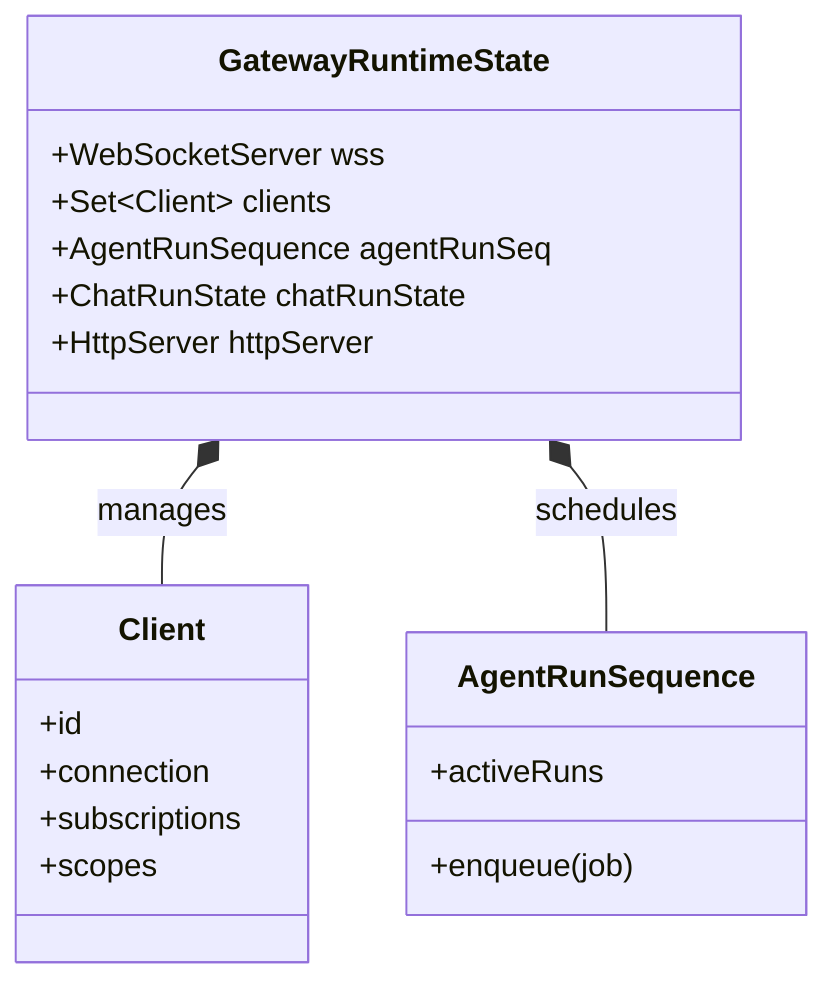
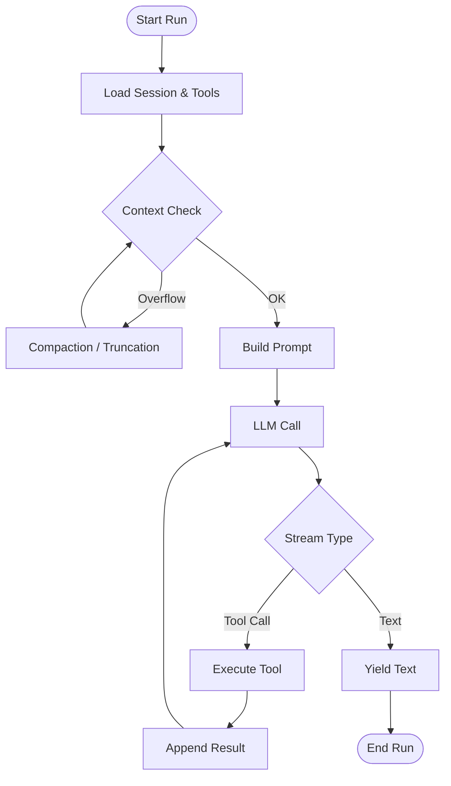
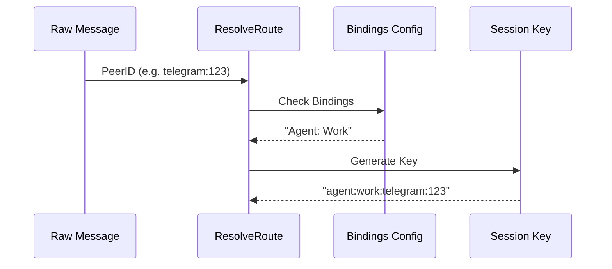
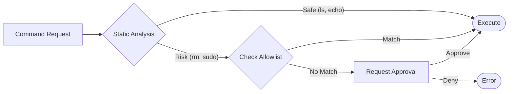

# OpenClaw: Deep Dive into Core Modules

This document provides a detailed breakdown of the four most critical modules in OpenClaw. It goes beyond the high-level architecture to explain the *how* and *why* of the implementation.

## Module 1: The Gateway (The Sovereign Control Plane)

**Role**: The Gateway is the long-running process that owns the world. It survives agent crashes, manages all external connections, and holds the authoritative state.

### 1.1. Design Philosophy: "Centralized State, Decentralized Execution"
*   **Sovereignty**: The Gateway is the single source of truth. If the Gateway dies, the system is dead. If an Agent dies, it's just a failed request.
*   **Protocol-Agnostic**: Clients (CLI, Web, Mobile) all speak the same WebSocket protocol. The Gateway doesn't care *who* you are, only what scope you have.

### 1.2. Implementation: `GatewayRuntimeState`
Located in `src/gateway/server-runtime-state.ts`, this object is the brain.

*   **WebSocket Protocol**: The Gateway uses a custom JSON-RPC-like protocol over WebSocket (`src/gateway/server-ws-runtime.ts`).
    *   **Handshake**: Clients authenticate via a token.
    *   **Subscriptions**: Clients subscribe to events (e.g., `session:update`) to receive real-time streams.
    *   **Methods**: Clients invoke methods like `chat.send` or `sessions.list`.

### 1.3. Concurrency Control
The Gateway uses **Lanes** (`src/process/command-queue.ts`) to manage concurrency.
*   **The Problem**: Multiple inputs (User message, Cron job, Webhook) arriving simultaneously for the same session could corrupt the state.
*   **The Solution**: An in-memory queue that serializes execution per "lane" (usually the Session ID).
*   **Mechanism**: `enqueueCommandInLane(lane, task)` ensures `task N+1` only starts after `task N` resolves or rejects.

---

## Module 2: The Agent Engine (The Ephemeral Brain)

**Role**: The Agent Engine (`PiEmbeddedRunner`) executes the cognitive loop. It is stateless *between* runs but stateful *during* a run.

### 2.1. Design Philosophy: "Context is Currency"
*   **Ephemerality**: An agent spins up, loads context from disk, answers, and spins down. It does not stay resident in memory.
*   **Token Economy**: Every character counts. The system aggressively manages the context window to prevent overflows and reduce costs.

### 2.2. Implementation: The Run Loop
Located in `src/agents/pi-embedded-runner/run/attempt.ts`.

*   **Session Persistence**: Conversations are stored as append-only JSONL files (`~/.openclaw/sessions/`). This ensures robust recovery even if the process crashes mid-write.
*   **Context Guard**: Before every LLM call, `ContextWindowGuard` (`src/agents/context-window-guard.ts`) checks token usage.
    *   **Soft Limit**: Warns the user.
    *   **Hard Limit**: Triggers **Compaction** (summarizing history) or **Truncation** (cutting large tool outputs).

---

## Module 3: Channels (The Universal Adapter)

**Role**: Channels normalize the chaotic world of external messaging platforms into a clean, internal representation.

### 3.1. Design Philosophy: "Normalization at the Edge"
*   **Universal Schema**: Internally, everything is an `InboundMessage` with standard fields (`text`, `images`, `sender`).
*   **Routing Logic**: The Channel determines *which* agent should handle a message, but the Gateway determines *how* to run it.

### 3.2. Implementation: The Routing Pipeline
Located in `src/channels/routing/resolve-route.ts`.

*   **Peer Resolution**: A "Peer" is the chat entity (User, Group, Thread).
*   **Session Key**: A unique string acting as the primary key for the conversation (e.g., `agent:default:telegram:12345`).
*   **Debouncing**: `createInboundDebouncer` (`src/auto-reply/inbound-debounce.ts`) groups rapid-fire messages (like a user sending 3 short texts in 1 second) into a single agent turn to save tokens and reduce noise.

---

## Module 4: Infrastructure (Safety & Reliability)

**Role**: The bedrock layer that ensures the system doesn't accidentally destroy your computer or lose your data.

### 4.1. Design Philosophy: "Defense in Depth"
*   **Assume Compromise**: The agent is running arbitrary code (LLM output). We assume the LLM *might* hallucinate a dangerous command (`rm -rf /`).
*   **Verify, Then Trust**: Every execution passes through multiple gates.

### 4.2. Implementation: Execution Approvals
Located in `src/infra/exec-approvals.ts`.

*   **Static Analysis**: Simple heuristics check for obviously dangerous patterns.
*   **Allowlist**: Users can permanently allow specific commands (e.g., `git status`).
*   **Socket-Based Approval**: If a command is blocked, the Gateway sends a request to the UI. The execution *pauses* and waits for the user to click "Approve".

### 4.3. Reliability: Delivery Queue
Located in `src/infra/outbound/delivery-queue.ts`.
*   **Persistence**: Outbound messages are written to disk *before* attempting to send.
*   **Retry Loop**: If the network fails, the system retries with exponential backoff (5s -> 10m).
*   **Crash Recovery**: On startup, the Gateway scans the queue directory and resumes any pending messages.

---

## Summary: The Symphony of Modules

1.  **Gateway** holds the baton (State).
2.  **Channels** bring the sheet music (Input).
3.  **Agents** play the instruments (Execution).
4.  **Infra** ensures the stage doesn't collapse (Safety).

This modularity allows OpenClaw to be robust, extensible, and safe while running entirely on your local machine.
